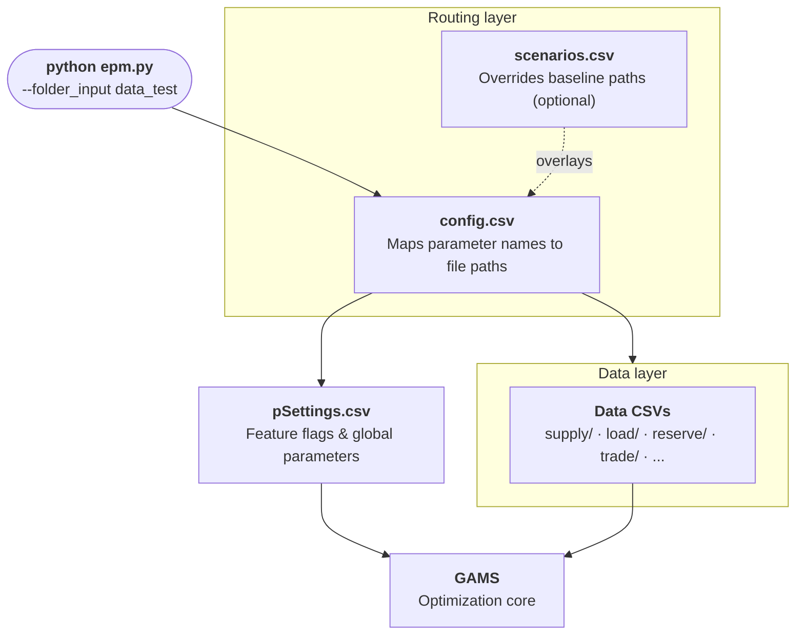

# Setup

This page explains how EPM's input system works: how files are organized, how the model finds them, and how to configure a run.

---

## How it works

EPM uses a layered input system. Each layer has a distinct role:



1. You point EPM to an input folder (`--folder_input`). All data lives inside it.
2. `config.csv` is the master routing table: it maps every parameter name to its CSV file path within that folder.
3. `pSettings.csv` is one of those files. It controls model behavior: features, discount rates, reserve margins, CO₂ constraints, etc.
4. All other CSV files contain the actual data: plants, demand, fuel prices, transmission limits, etc.
5. If you pass `--scenarios`, a `scenarios.csv` overlays changes on the baseline. Only the files that differ need to be specified.

---

??? "config.csv"

    The master routing table. Located at `epm/input/<folder_input>/config.csv`.

    ```csv
    metadata,paramNames,file
    Global model settings,pSettings,config/pSettings.csv
    Planning horizon years,y,config/y.csv
    Zone-country mapping,zcmap,config/zcmap.csv
    Demand profiles,pDemandProfile,load/pDemandProfile.csv
    ...
    ```

    Each row maps a `paramName` (used internally by GAMS) to a file path relative to the input folder. To use a different file for any parameter, just change the path here.

    | Category | Parameters |
    |---|---|
    | **GENERAL** | pSettings, y, zcmap, pHours |
    | **STATIC** | pDays, mapTS |
    | **LOAD** | pDemandProfile, pDemandData, pDemandForecast, sRelevant, pEnergyEfficiencyFactor |
    | **SUPPLY** | pGenDataInput, pGenDataInputDefault, pAvailability, pAvailabilityDefault, pCapexTrajectories, pCapexTrajectoriesDefault, pFuelPrice, pVREProfile, pVREgenProfile |
    | **RESERVE** | pPlanningReserveMargin, pSpinningReserveReqCountry, pSpinningReserveReqSystem |
    | **CONSTRAINT** | pEmissionsTotal, pEmissionsCountry, pMaxFuellimit, pCarbonPrice |
    | **TRADE** | zext, pExtTransferLimit, pLossFactorInternal, pMaxAnnualExternalTradeShare, pNewTransmission, pTradePrice, pTransferLimit |
    | **H2** | pH2DataExcel, pAvailabilityH2, pCapexTrajectoryH2, pExternalH2, pFuelDataH2 |

??? "pSettings.csv"

    Controls which model features are active and sets global economic parameters. Located at `config/pSettings.csv`.

    Key flags; see [Input Catalog](input_detailed.md) for the full parameter table.

    | Category | Key parameters |
    |---|---|
    | **Capacity & Dispatch** | `fEnableCapacityExpansion` · `fDispatchMode` |
    | **Economics** | `WACC` · `DR` · `VoLL` · `CO2backstop` |
    | **Trade** | `fEnableInternalExchange` · `fEnableExternalExchange` · `fAllowTransferExpansion` |
    | **Reserves** | `fApplyPlanningReserveConstraint` · `sReserveMarginPct` · `fApplyCountrySpinReserveConstraint` |
    | **Policy** | `fApplyCountryCo2Constraint` · `sMinRenewableSharePct` · `fEnableCarbonPrice` |
    | **Features** | `fEnableStorage` · `fEnableCSP` · `fEnableH2Production` · `fEnableEconomicRetirement` |

??? "Custom / Default system"

    For generation data, availability, and CAPEX trajectories, EPM distinguishes two file types:

    - `xxDefault.csv`: default values indexed by **zone · technology · fuel**, shared across plants
    - `xxCustom.csv`: **plant-level** values that override defaults where specified

    | Case | Behavior |
    |---|---|
    | Field missing in Custom | Value from Default is used |
    | Field present in Custom | Value **overrides** the Default |

    This lets you populate the Default files once (typically from the CCDR standard dataset) and only specify deviations for particular plants in the Custom files.

    !!! tip "Getting started"
        Copy the Default files from `data_test` or `data_test_region`, then adapt them to your zones, technologies, and fuels. Ensure all zone/tech/fuel combinations are covered in at least one file.

    !!! warning
        For `pAvailabilityDefault.csv` and `pCapexTrajectoriesCustom.csv`, missing values for any zone/tech/fuel combination may cause errors. For `pGenDataInputCustom.csv`, missing optional fields (e.g., Capex, VOM) silently default to zero.

??? "Scenarios"

    Scenarios overlay changes on the baseline `config.csv`. Define a `scenarios.csv` where each column is a scenario variant — only the files that differ need to be specified. Empty cells inherit the baseline.

    ```csv
    paramNames,HighDemand,LowFuel
    pDemandForecast,demand/high_demand.csv,
    pFuelPrice,,supply/fuel_low.csv
    pSettings,pSettings_alt.csv,
    ```

    Run with:

    ```bash
    python epm.py --folder_input data_test --scenarios scenarios.csv
    ```

    | Scenario type | How |
    |---|---|
    | **Standard** | Override file paths in `scenarios.csv` |
    | **Sensitivity** | `--sensitivity` — systematic parameter variation |
    | **Monte Carlo** | `--montecarlo` — sample from uncertainty distributions |
