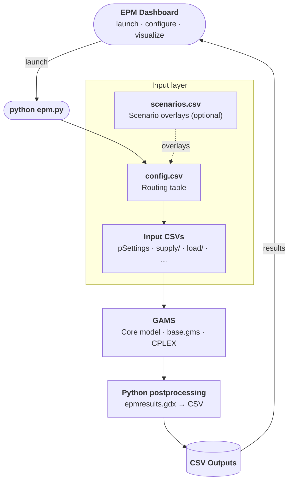

# How EPM Works

EPM is implemented in **GAMS** (General Algebraic Modeling System), with a **Python** orchestration layer that handles input preparation, multi-scenario execution, and postprocessing. No GAMS or Python knowledge is required for standard use, though familiarity with either unlocks deeper customization and flexibility.

A quick map of the model, the repository, and the typical workflow — so you know where everything lives before diving in.


---

## End-to-end flow

<div class="compact-diagram" markdown="1">

</div>

EPM can be launched from the **Dashboard** or directly via the Python CLI. Either way, inputs flow through a routing layer (`config.csv`) to GAMS, which solves the optimization and writes a binary results file. Python postprocessing converts that to CSV outputs, which the Dashboard reads for visualization.

---

## Repository structure

```plaintext
EPM/
├── epm/                    # Core model — work here
│   ├── epm.py              # Python entry point (always run from here)
│   ├── main.gms            # GAMS orchestration
│   ├── base.gms            # Core optimization equations
│   ├── input/              # One subfolder per study (data_test, data_senegal, ...)
│   ├── postprocessing/     # Output scripts and chart config
│   ├── resources/          # Shared defaults and column headers
│   └── output/             # Generated results (auto-created on run)
├── pre-analysis/           # Data preprocessing pipelines
├── tools/                  # Utility scripts
├── docs/                   # This documentation
└── requirements.txt
```

Each study lives in its own folder inside `epm/input/`. The minimum required files are a `config.csv` (routing table) and the CSV files it points to.

---

## Typical workflow

1. **Install** — set up Python and GAMS, install dependencies → [Installation](../run/run_installation.md)
2. **Prepare inputs** — create your input folder with `config.csv` and data CSVs → [Input Setup](../input/input_setup.md)
3. **Run** — launch from the Dashboard or via `python epm.py --folder_input your_data` → [Run from Python](../run/run_python.md)
4. **Analyze results** — outputs land in `epm/output/`, read by the Dashboard or directly as CSVs → [Output Overview](../output/output_overview.md)

---

## About this documentation

| Tab | What it covers |
|---|---|
| **Installation & Run** | Getting EPM running: install, CLI options, GAMS Studio, remote server |
| **Model** | The math: objective function, constraints, time representation |
| **Input** | Input file formats, parameter catalog, typical values, open data sources |
| **Output** | Output files, charts, Tableau dashboard, Python postprocessing |
| **Contributing** | How to report issues, contribute code or documentation |
| **Resources** | Pre-processing tools, planning process, publications |
