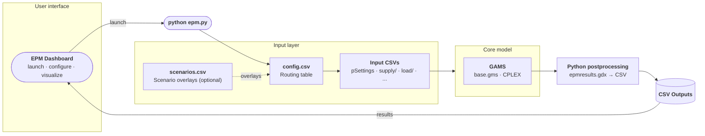

# Tempo

```mermaid
flowchart LR
    subgraph ui ["User interface"]
        DASH(["<b>EPM Dashboard</b>\nlaunch · configure · visualize"])
    end

    CLI(["<b>python epm.py</b>"])

    subgraph inputs ["Input layer"]
        CONFIG["<b>config.csv</b>\nRouting table"]
        SCEN["<b>scenarios.csv</b>\nScenario overlays (optional)"]
        CSV["<b>Input CSVs</b>\npSettings · supply/ · load/ · ..."]
    end

    subgraph core ["Core model"]
        GAMS["<b>GAMS</b>\nbase.gms · CPLEX"]
    end

    POST["<b>Python postprocessing</b>\nepmresults.gdx → CSV"]
    OUT[("<b>CSV Outputs</b>")]

    DASH -->|launch| CLI
    CLI --> CONFIG
    SCEN -.->|overlays| CONFIG
    CONFIG --> CSV
    CSV --> core
    GAMS --> POST
    POST --> OUT
    OUT -->|results| DASH
```
