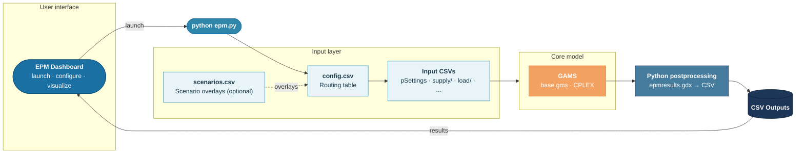

# Tempo

```mermaid
flowchart LR
    subgraph ui ["User interface"]
        DASH(["<b>EPM Dashboard</b>\nlaunch · configure · visualize"])
    end

    CLI(["<b>python epm.py</b>"])

    subgraph inputs ["Input layer"]
        CONFIG["<b>config.csv</b>\nRouting table"]
        SCEN["<b>scenarios.csv</b>\nScenario overlays (optional)"]
        CSV["<b>Input CSVs</b>\npSettings · supply/ · load/ · ..."]
    end

    subgraph core ["Core model"]
        GAMS["<b>GAMS</b>\nbase.gms · CPLEX"]
    end

    POST["<b>Python postprocessing</b>\nepmresults.gdx → CSV"]
    OUT[("<b>CSV Outputs</b>")]

    DASH -->|launch| CLI
    CLI --> CONFIG
    SCEN -.->|overlays| CONFIG
    CONFIG --> CSV
    CSV --> core
    GAMS --> POST
    POST --> OUT
    OUT -->|results| DASH

    classDef dashboard fill:#1a6fa3,stroke:#0d4f7a,color:#fff,rx:8
    classDef cli fill:#2e86ab,stroke:#1a6fa3,color:#fff
    classDef inputNode fill:#e8f4f8,stroke:#2e86ab,color:#1a3a4a
    classDef coreNode fill:#f4a261,stroke:#e07d3a,color:#fff
    classDef postNode fill:#457b9d,stroke:#1d3557,color:#fff
    classDef outNode fill:#1d3557,stroke:#0d2035,color:#fff

    class DASH dashboard
    class CLI cli
    class CONFIG,SCEN,CSV inputNode
    class GAMS coreNode
    class POST postNode
    class OUT outNode
```
