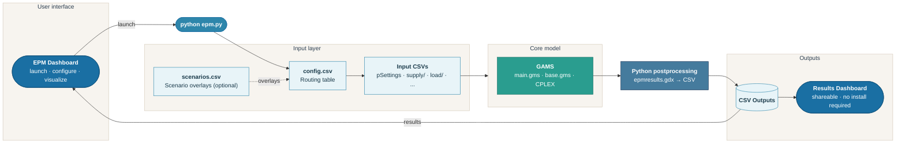

# Tempo

```mermaid
flowchart LR
    subgraph ui ["User interface"]
        DASH(["<b>EPM Dashboard</b>\nlaunch · configure · visualize"])
    end

    CLI(["<b>python epm.py</b>"])

    subgraph inputs ["Input layer"]
        CONFIG["<b>config.csv</b>\nRouting table"]
        SCEN["<b>scenarios.csv</b>\nScenario overlays (optional)"]
        CSV["<b>Input CSVs</b>\npSettings · supply/ · load/ · ..."]
    end

    subgraph core ["Core model"]
        GAMS["<b>GAMS</b>\nmain.gms · base.gms · CPLEX"]
    end

    POST["<b>Python postprocessing</b>\nepmresults.gdx → CSV"]

    subgraph outputs ["Outputs"]
        direction TB
        OUT[("<b>CSV Outputs</b>")]
        RDASH(["<b>Results Dashboard</b>\nshareable · no install required"])
    end

    DASH -->|launch| CLI
    CLI --> CONFIG
    SCEN -.->|overlays| CONFIG
    CONFIG --> CSV
    CSV --> core
    GAMS --> POST
    POST --> OUT
    OUT -->|results| DASH
    OUT --> RDASH

    classDef dashboard fill:#1a6fa3,stroke:#0d4f7a,color:#fff
    classDef cli fill:#2e86ab,stroke:#1a6fa3,color:#fff
    classDef inputNode fill:#e8f4f8,stroke:#2e86ab,color:#1a3a4a
    classDef coreNode fill:#2a9d8f,stroke:#1f7268,color:#fff
    classDef postNode fill:#457b9d,stroke:#1d3557,color:#fff
    classDef outNode fill:#1d3557,stroke:#0d2035,color:#fff

    class DASH,RDASH dashboard
    class CLI cli
    class CONFIG,SCEN,CSV inputNode
    class GAMS coreNode
    class POST postNode
    class OUT inputNode

    style ui fill:#f7f4ef,stroke:#d4c9b8,color:#2c3e50
    style inputs fill:#f7f4ef,stroke:#d4c9b8,color:#2c3e50
    style core fill:#f7f4ef,stroke:#d4c9b8,color:#2c3e50
    style outputs fill:#f7f4ef,stroke:#d4c9b8,color:#2c3e50
```
