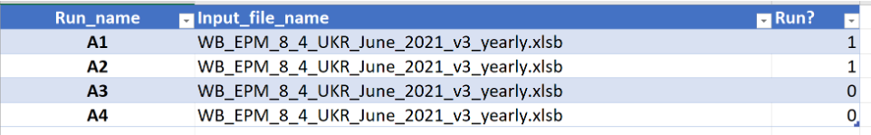

# Engine Looping Tool

__This code is not maintained anymore. We know suggest to refer to Run with EPM section to run multiple simulations, and
to launch directly the simulations on the Engine.__

---
## Disclamer
- Be careful when launching multiple simulations as it consume large amount of resources
- Please do not use too much threads in the CPLEX option file if you don’t need to or you know others are running the models too 

## Introduction
The Engine Looping Tool facilitates running GAMS models efficiently by preparing, executing, and managing input/output files, including support for GAMS Engine. This manual provides step-by-step guidance for using the tool.

Specifically, the tool allows users to:
- Send simulation to the GAMS Engine: `use_engine` function.
- **Sensitivity Analysis**: Generate multiple files for different scenarios by marginally changing one parameter or constraint. Possible actions include:
  - Change emission constraint year by year.
  - Insert any GAMS command into the model (e.g., add emission constraint, or allowing export).

## Structure of the Looping Tool

### Files and Scripts
- `Looping_input.xlsx`: Dashboard for defining runs, input files, and options.
- `Looping.py`: Python script for manipulating files, running models, and managing uploads.
- Model files: Base GAMS model files and additional input Excel files.

### `Looping_input.xlsx`
1. **Main Tab**: necessary tab to run the model, serving a role of a dashboard for the script. In this tab you might define all the parameters regarding the runs, input files, names of the runs and running options.

2. **Auxiliary Tabs**: All the other tabs serve as auxiliary tabs to change the model parameters and data (without changing the input file). It is possible to add more tabs if specific parameter is often changed (e.g. fuel prices) however then the script need to be slightly modified

#### Main Tab


In the __first table__ of the Main tab you define the names of the runs, corresponding input file names and if you want to run the file (option 1). You can define 0 without deleting the entire row. The Run_name will be the name of the separate folder for the run files and the name of the generated `.gms` files.




In the __second table__ of the Main tab you define the tabs that should be included in the runs. It is not required to select any of the tabs to run the model in the loop or send it to Engine. Using this option requires slight modification in the model main file  (explained at the end of the presentation).


In the __third table__ of the Main tab you define how you would like to perform the runs. 
- If RUN_PARALLEL is 1, then the model will run the cases in parallel. Otherwise cases will be run in the sequence in the same batch file. 
- If CREATE_RESTART is 0 then the model will run the cases on the local machine (in parallel or in sequence depending on RUN_PARALEL). If this parameter is 1 then the model will not run the model, but only prepare the restart file that might be uploaded to the engine. 
- If SEPARATE_FOLDERS is 1 then script will create folder to store the results of each run or the restart files. Otherwise all the runs will be saved in the current folder. 

The __last table__ refers to the CPLEX options. Here you might define the options of the solver as you do in the input data file to the model in Settings tab. 

### `Looping.py`


Requirements of the script. The following `Python` packages are used: `pandas`, `os`, `subprocess`, `time`, `datetime`, `shutil`, `zipfile`, `pkgutil`.

In order to send the file to the Engine automatically the following APIs needs to be instaled:
1. [GAMS Python API](https://www.gams.com/34/docs/API_PY_TUTORIAL.html).
2. [gams_engine](https://www.gams.com/engine/clients.html). You can also look at the [issue opened in the GAMS gitlab](https://git.gams.com/devel/wb-epm/-/issues/36). You need this one only for the engine purposes.

---

## Running the Model Locally

### Example: Local Run
1. Define scenarios in the `Main` tab.
2. Set `RUN_PARALLEL = 1` to run cases simultaneously.
3. Outputs include scenario-specific `.gms` and result files.

### Example: Restart Files
1. Set `CREATE_RESTART = 1` to generate `.g00` files for uploading.
2. Restart files and `.gms` files are created for Engine submission.

---

## Sending Files to the Engine

### Function: `use_engine`
- Sends `.g00` and `.gms` files to the Engine.
- Requires credentials for Engine API.
- Generates tokens to track runs and import results.

---

## Changing Input Data

### Emissions and Text Tabs
1. Insert emission limits and additional GAMS commands into the respective tabs.
2. Generates `.inc` files to include in the model.

### Including `.inc` Files in the Model
Add the following lines to the model's main file:
```gams
$offIDCProtect
$if set INC_NUM $include inc_file%INC_NUM%.inc
$onIDCProtect
```

---


---

## Notes
- Ensure proper API and library installations before running the script.
- Always verify `.g00` and `.gms` file preparation before uploading to the Engine.
