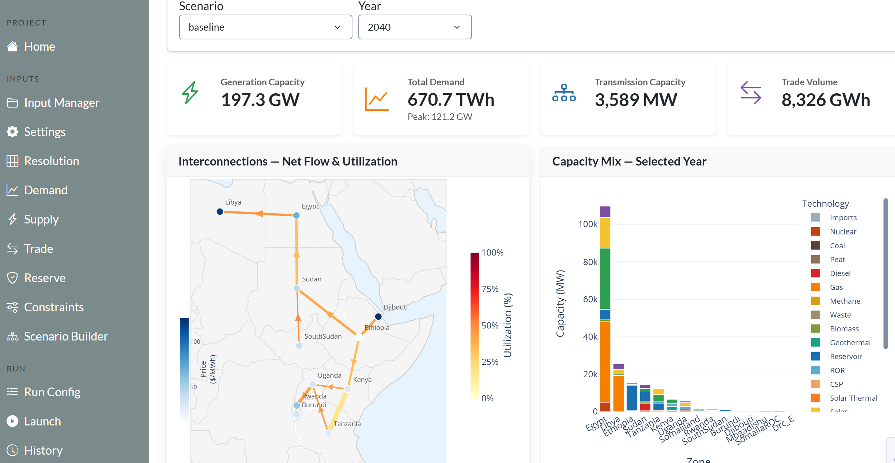
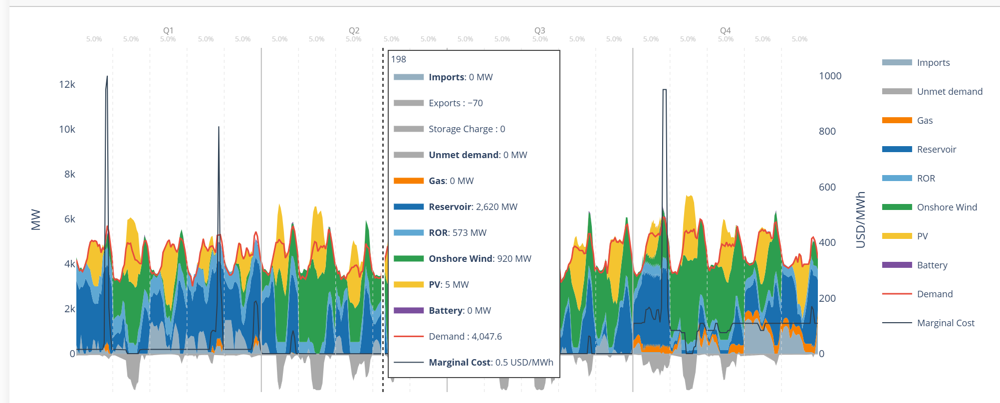
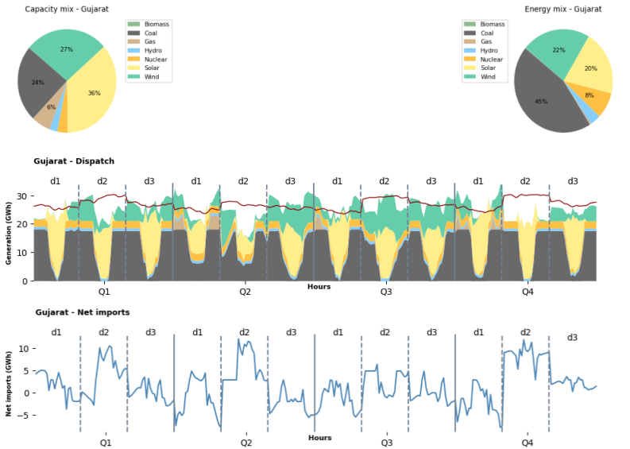
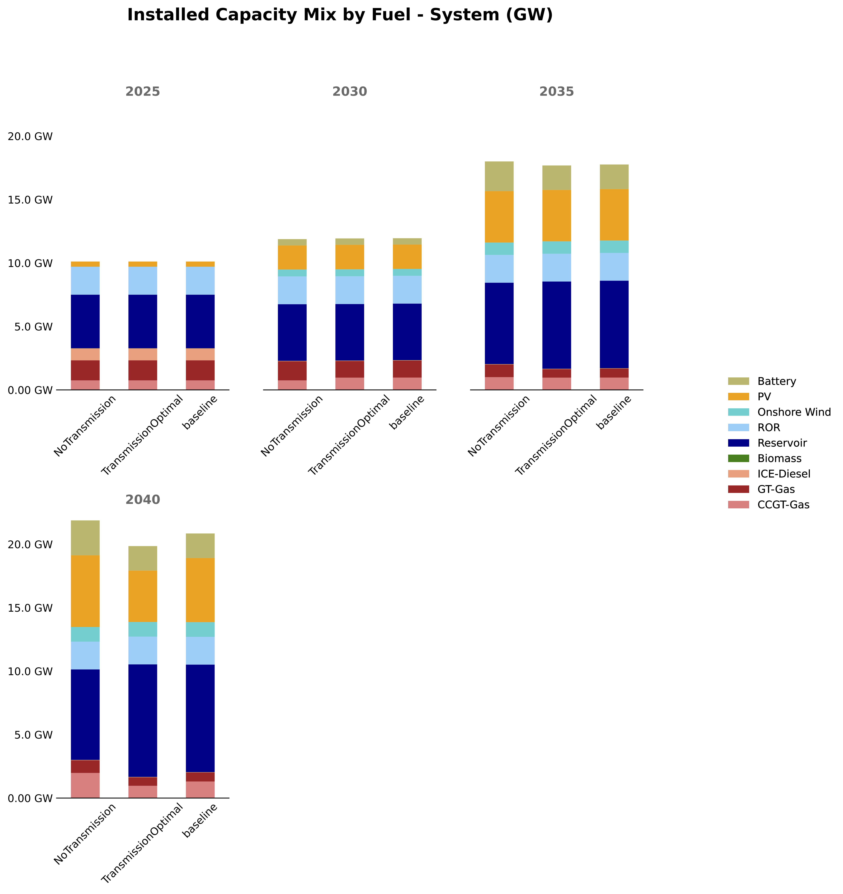
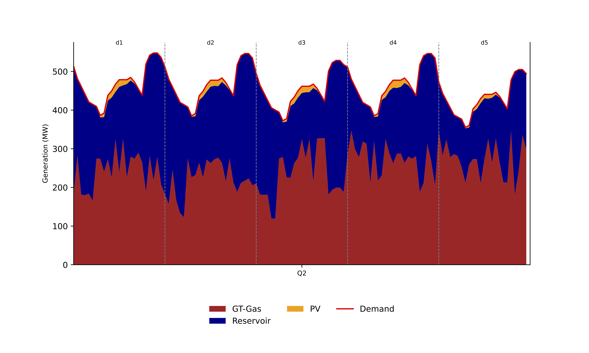

# Visualization

EPM outputs are standard CSV files and a GDX binary — you can load them into any tool you prefer. Three ready-made options are available if you don't want to start from scratch.

---

## Options at a glance

| Option | Best for | Requires |
|---|---|---|
| **EPM Dashboard** | Quick interactive exploration, non-technical users | Web browser |
| **Python** | Custom analysis, scripting, reproducible figures | Python + Jupyter |
| **Tableau** | Polished stakeholder dashboards, scenario comparison | Tableau Creator license |

---

## EPM Dashboard

The built-in web dashboard lets you explore results interactively — without writing any code. It can also be used to **launch model runs** and configure scenarios directly (see [How EPM Works](../introduction/introduction_workflow.md)).

The dashboard reads the CSV outputs from `output_csv/` automatically once a run completes.


*Results overview — capacity, energy, and cost indicators across scenarios.*


*Dispatch view — hourly generation by technology.*


!!! info ""
    The dashboard is in continuous development. Feedback and contributions are welcome.

---

## Python Postprocessing

For users who want full control over analysis and figures. The postprocessing library is at `epm/postprocessing/utils.py` and is designed to be used from **Jupyter notebooks**.

**Recommended for**: custom plots, aggregation across runs, Monte Carlo analysis, publication-quality figures.

### Key functions

**Data loading**

| Function | What it does |
|---|---|
| `extract_gdx(path)` | Reads `epmresults.gdx` into a dict of DataFrames |
| `extract_epm_folder(folder)` | Loads results from multiple scenarios at once |
| `process_simulation_results(folder)` | Full pipeline: inputs + outputs, ready to plot |
| `generate_summary(folder)` | Creates `summary.csv` from all scenario results |

**Plotting**

| Function | Chart type |
|---|---|
| `make_stacked_barplot()` | Capacity/energy evolution across years and scenarios |
| `make_stacked_areaplot()` | Generation dispatch area chart |
| `dispatch_plot()` | Combined stacked area + demand line |
| `bar_plot()` / `line_plot()` | Standard bar and time-series charts |
| `make_capacity_mix_map()` | Regional map with pie chart overlays |
| `make_interconnection_map()` | Transmission capacity map |
| `create_interactive_map()` | Interactive Folium map (HTML) |

### Quick start

```python
from postprocessing.utils import process_simulation_results, make_stacked_barplot

results = process_simulation_results("output/simulations_run_20250101_120000")
make_stacked_barplot(results["pCapacityFuel"], title="Capacity Mix Evolution")
```

!!! tip
    Use `extract_epm_folder(..., save_to_csv=True)` to convert any GDX-only variable to CSV on demand.

### Example notebook

!!! info "Coming soon"
    An example Jupyter notebook walking through a full postprocessing workflow will be added here.

### Example outputs


*Overview of results across scenarios.*


*`make_stacked_barplot()` — capacity mix evolution across scenarios.*


*`dispatch_plot()` — hourly dispatch for representative days.*

---

## Tableau

Interactive dashboards using the EPM Tableau template. Best suited for **sharing results with stakeholders** or comparing multiple scenarios side-by-side.

Example: [SAPP Dashboard on Tableau Public](https://public.tableau.com/app/profile/lucas.vivier4911/viz/SAPP_Report/Home)

!!! warning "License required"
    A **Tableau Creator license** is needed to create or edit dashboards. Contact the energy planning team for access.

### Setup

**1. Prepare the folder structure**

```plaintext
tableau/
├── EPM_Report.twb             # Download template (link below)
├── ESMAP_logo.png
├── linestring_countries.geojson
└── scenarios/
    ├── baseline/              # One scenario must be named "baseline"
    │   └── output_csv/
    │       └── *.csv
    └── scenario_1/
        └── output_csv/
```

Download the template: [EPM_Report.twb](../dwld/ESMAP_Tableau_v2.twb)

**2. Generate the GeoJSON**

Update `geojson_to_epm.csv` with your zone names, then run:

```bash
cd epm/postprocessing
python create_geojson.py --folder tableau --geojson geojson_to_epm.csv --zcmap zcmap.csv
```

This produces `linestring_countries.geojson` for geographic visualizations.

**3. Open in Tableau**

Upload the `tableau/` folder to OneDrive, connect to the shared VDI (Tableau pre-installed), and open `EPM_Report.twb`.

**4. Extract data**

Tableau opens in live mode by default, which is slow. Extract each dataset (`Database_Compare`, `Main_Database`, `pCostSummaryWeightedAverageCountry`, `Plant DB`, `pSummary`) via `Data → Extract Data → Save settings`.

**5. Publish**

Go to `Server → Tableau Public → Save to Tableau Public as` to share your dashboard.

### Updating for new scenarios

1. Replace CSV files in `scenarios/` with new run outputs (keep `baseline` folder name).
2. For each dataset: `Extract → Remove` → then re-extract (Step 4).
3. Re-publish to Tableau Public.

!!! tip
    If nothing shows up: check the folder structure, verify filters are not hiding data, and confirm extraction completed successfully.
