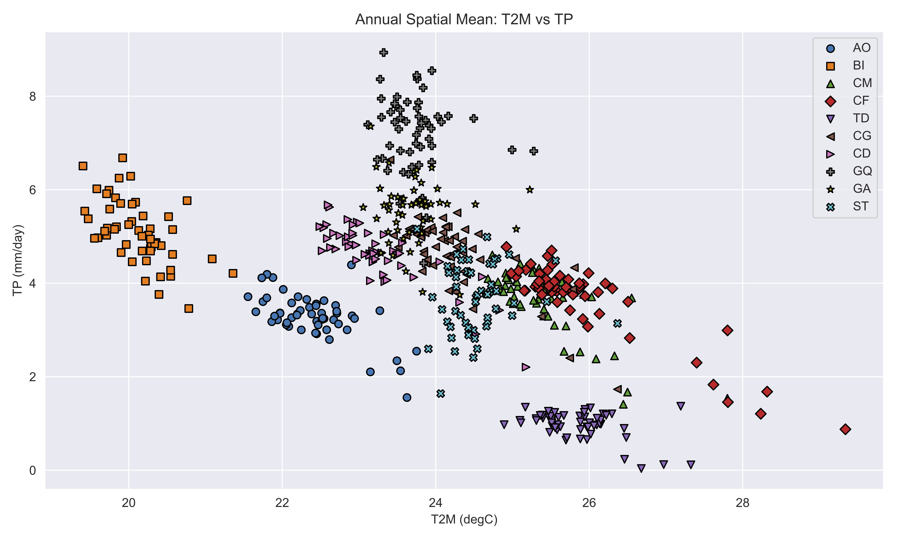
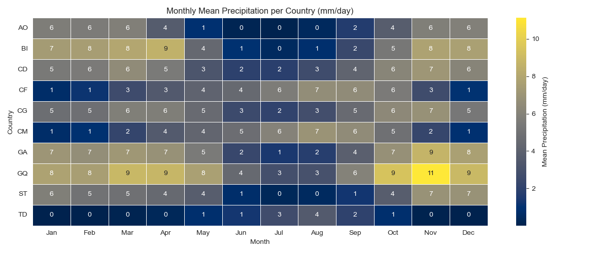
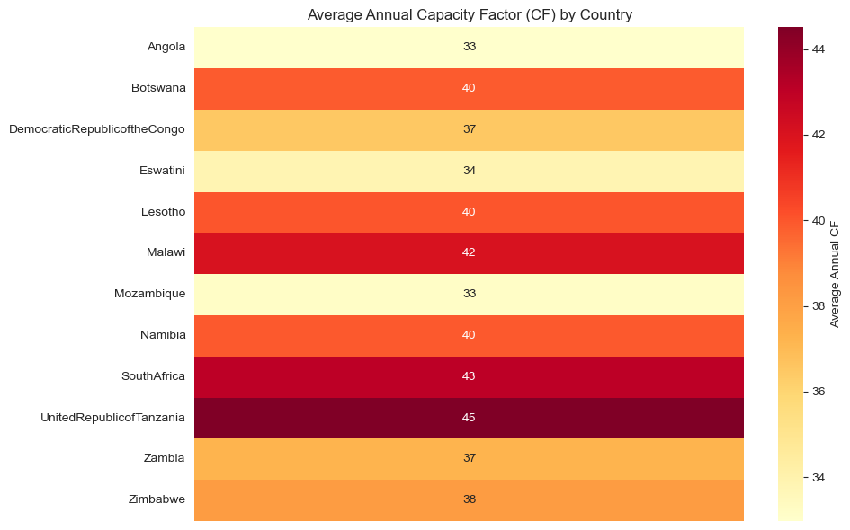
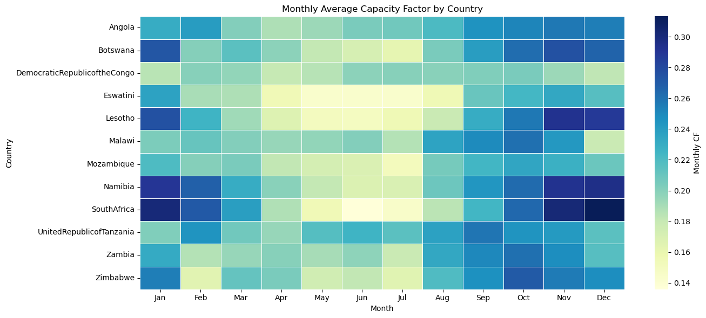

# Data Preparation Workflow Documentation

This document details the data preparation workflow for energy modeling using various Jupyter notebooks. It covers climatic data analysis, renewable energy profiles, generation datasets, load profiles, representative days, and hydropower data integration.

---

## Summary Table

| Step | Notebook | Key Inputs | Key Outputs |
|------|----------|------------|-------------|
| 1 | `zcmap.csv` | List of countries/zones | Perimeter definition |
| 2 | `pre-analysis/climatic/climatic_overview.ipynb` | `zcmap.csv` | Climate overview plots |
| 3 | `climatic/get_renewables_irena_data.ipynb` | List of countries (SPLAT names) | Renewable profiles (solar, wind) |
| 3 | `climatic/get_renewables_ninja_data.ipynb` | Coordinates from `generation/get_renewables_coordinates.ipynb` | Renewable profiles (solar, wind) |
| 3 | `generation/get_renewables_coordinates.ipynb` | Country names or zones | Coordinates for Renewable Ninja |
| 4 | `global_database_overview.ipynb` | None | Generation project map, aggregated data |
| 5 | `load/treat_load_profile.ipynb` | Existing load data | Smoothed load profiles |
| 5 | `load/generate_load_profile.ipynb` | Hourly load shapes, monthly means | Synthetic load profiles |
| 6 | `representative_days.ipynb` | Climate and load profiles | `pHours.csv`, `load/pDemandProfile.csv`, `supply/pVREProfile.csv` |
| 7 | `hydro_capacity_factor.ipynb` | IRENA hydropower atlas, `supply/pGenDatExcel.csv` | Monthly hydro capacity factors |
| 7 | `hydro_basins_map.ipynb` | Basin shapefiles | Hydro basin maps |
| 7 | `hydro_inflow_analysis.ipynb` | GRDC inflow data | Inflow analysis |
| 7 | `hydro_atlas_comparison.ipynb` | Utility data, IRENA atlas | Atlas comparison plots |

---

## 1. Define Perimeter Countries/Zones

- Define the perimeter of countries or zones to study.
- Fill the file: `zcmap.csv`
- This file should include the names of countries/zones used throughout the analysis.

---

## 2. Run Climatic Overview

Notebook: `pre-analysis/climatic/climatic_overview.ipynb``
- Objective: Understand precipitation and temperature patterns to determine representative seasons.
- Input: List of countries/zones from `zcmap.csv`.
- Output: Climate overview plots.





---

## 3. Get Solar and Wind Information

### Option 1 — IRENA Data

Notebook: `climatic/get_renewables_irena_data.ipynb`
- Recommended for obtaining solar and wind profiles.
- Input: List of countries using SPLAT model names.
- Output:
  - Hourly renewable profiles by zone and season.
  - Files structured with columns:
    ```
    zone, season, day, hour, <climatic_year>
    ```

Example outputs (images stored in `dwld` folder):

| LCOE Solar | Wind Heatmap |
|------------|--------------|
|  |  |

---
### Option 2 — Renewable Ninja Data

Notebook: `climatic/get_renewables_ninja_data.ipynb``
- Alternative source for solar and wind profiles.
- Requires geographical coordinates from:

Notebook: `generation/get_renewables_coordinates.ipynb``
- Outputs follow the same format:
  ```
  zone, season, day, hour, <climatic_year>
  ```
---

## 4. Make Generation List

Notebook: `generation/global_database_overview.ipynb`
- Purpose: Compare aggregated results by technology or fuel.
- Goal: Create the EPM input file: `supply/pGenDatExcel.csv``

- Generates:
- Aggregated data summaries.
- Map of generation projects.

Example map output:

[Open Power Map](dwld/pre-analysis/power_map.html)

---

## 5. Generate Load Profile

Two approaches:

### 5.1 Smooth Existing Load Data

Notebook: `load/treat_load_profile.ipynb`
- Input: Actual load data.
- Output: Smoothed load profiles.


### 5.2 Generate Synthetic Load Profile

Notebook: `load/generate_load_profile.ipynb`
- Input:
  - Hourly load profile shapes.
  - Monthly mean values.
- Output: Synthetic hourly load profiles.

---

## 6. Generate Representative Days

Notebook: `representative_days/epresentative_days.ipynb`

- Uses:
  - Season definitions.
  - Data created in steps 2 and 4.
- Output:
  - `pHours.csv`
  - `load/pDemandProfile.csv`
  - `supply/pVREProfile.csv`

These files are in EPM format and ready for model integration.

---

## 7. Hydro Data Preparation

### 7.1 Monthly Capacity Factor

Notebook: `hydro_capacity_factor.ipynb`

- Input:
  - IRENA African Hydropower Atlas:
    ```
    IRENA African_Hydropower_Atlas.xlsx
    ```
  - Matching plant names from:
    ```
    supply/pGenDatExcel.csv
    ```
- Output:
  - Monthly hydro capacity factors.

---

### 7.2 Hydro Basin Mapping

Notebook: `hydro_basins_map.ipynb`

- Output: Map visualizations of hydro basins.

---

### 7.3 Advanced Hydro Analyses

#### Hydro Inflow Analysis

Notebook: `hydro_inflow_analysis.ipynb`
- Analyzes GRDC inflow data for climate change studies.

---

#### Hydro Atlas Comparison

Notebook:`hydro_atlas_comparison.ipynb`
- Compares utility data with IRENA hydropower atlas.

---

## Notes

- Always ensure consistency in naming conventions for zones/countries across all files.
- All renewable output formats are standardized to facilitate integration into the SPLAT or EPM models.