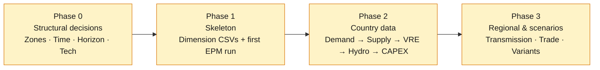
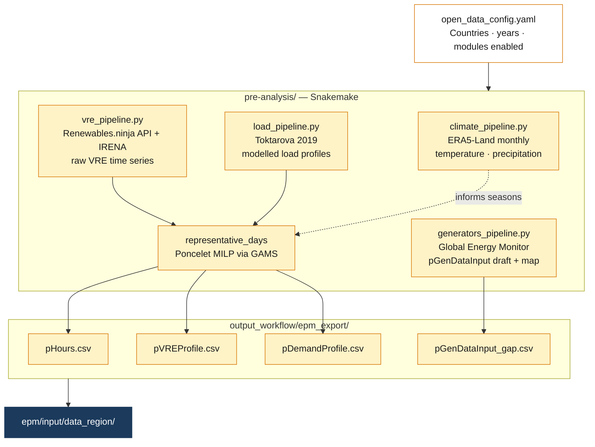

# Data Preparation

Building an EPM model follows four phases — structural decisions, skeleton, country data, scenarios. The order matters: a wrong structural choice made late forces most of the data collection to be redone.

---

## Overview



---

## Phase 0 — Structural decisions

These four decisions must be locked in before any data collection. They shape the dimensions of almost every CSV.

---

**Zones**

How many zones, and which ones. Drives the `z` dimension of nearly every CSV.

Method: define a floor (minimum to capture real physics) and a ceiling (computation + data constraints), test 3–4 levels on a simplified run, stop when total system cost varies less than ~2% between two consecutive levels.

Drivers for more zones: official bidding zones, documented grid congestion, RE capacity factor spread > 25%, country size > 500 000 km², hydro far from load centres.

| Tool | When to use |
|---|---|
| [gridflow (ESMAP)](https://github.com/ESMAP-World-Bank-Group/gridflow) | Partitions a region into N zones using population, load, and RE rasters |
| [PyPSA-Eur clustering](https://github.com/PyPSA/PyPSA-Eur) | Partitions using OSM substations weighted by load — best for regions with good OSM/ENTSO-E coverage |

---

**Representative time-slices**

Number of representative days, hourly resolution, extreme days. Drives `pHours.csv` and every hourly profile shape.

| | Guideline |
|---|---|
| Minimum | 4 days (seasons) · 8+ if RE penetration > 20% · 12+ if storage is significant |
| Extreme days | Always add 2–3: winter peak, RE drought |
| Maximum | Beyond 24–30 days, investment decisions rarely change |
| Validation | NRMSE on load duration curve < 3% · NRMSE on RE curves < 5% |

This is decided here but computed in Phase 1 once time series are available. The tool is integrated in the repo — see the Snakemake pipeline in Phase 1.

---

**Planning horizon**

Drives `y.csv`. Base year: most recent year with complete data (typically 1–2 years before study start). Planning years: every 5 years is standard (2030, 2035, 2040, 2045, 2050). End year: 2050 for carbon neutrality studies.

---

**Technology set**

Drives `tech.csv`, `fuel.csv`, `pTechFuel.csv`. Use the same set across all countries — country-specific availability is controlled via max capacity = 0, not a different tech list. Include candidate technologies (offshore wind, green hydrogen) even if not yet deployed. Avoid editing the list after Phase 1: it propagates through many CSVs.

---

## Phase 1 — Skeleton

Fill the CSVs that depend only on Phase 0 decisions, then run EPM with dummy data. The goal is not useful results — it is to verify the structure is sound before any real data collection.

| # | CSV | Content | How |
|---|---|---|---|
| 1 | `zcmap.csv` | Zone → country mapping | Manual |
| 2 | `y.csv` | Planning years | Manual |
| 3 | `tech.csv`, `fuel.csv` | Technology and fuel lists | Manual |
| 4 | `pTechFuel.csv` | Tech → fuel mapping | Manual |
| 5 | `pSettings.csv` | VOLL, discount rate, features | Copy from `data_test` |
| 6 | `pHours.csv` | Representative hours + weights | Snakemake pipeline ↓ |

### The Snakemake pipeline

`pHours.csv` and the associated hourly profiles are generated by the pipeline in `pre-analysis/`. Configure it once, run it, and copy the outputs to the study folder.



**Setup:**

```bash
conda env create -f pre-analysis/open_data_env.yml -n epm-open-data
conda activate epm-open-data

# API keys (both free)
cp pre-analysis/config/api_tokens.example.ini pre-analysis/config/api_tokens.ini
# → renewables.ninja token:  renewables.ninja/profile
# → CDS API key:             cds.climate.copernicus.eu
```

**Configure** `pre-analysis/config/open_data_config.yaml` — set countries, years, and number of representative days. Then run:

```bash
cd pre-analysis
snakemake --snakefile Snakefile --cores 4
```

Outputs land in `output_workflow/`. Copy `epm_export/` files to your study folder.

**End-of-Phase-1 test** — fill all remaining CSVs with dummy zeros, then:

```bash
python epm.py --folder_input data_<region> --diagnostic
```

The model must complete without errors. Failures here are structural, not data quality issues.

---

## Phase 2 — Country data

Fill CSVs in dependency order: demand first, then supply, VRE, hydro, CAPEX. Sizing generation before knowing the load leads to a fleet that doesn't match — everything has to be redone.

Start with the country where data is most available. After each country, run `--diagnostic` with that country populated and the rest as stubs.


---

**1. Demand**

| CSV | Content | Source |
|---|---|---|
| `pDemandForecast` | Annual peak + energy per zone/year | National utilities · [IEA WEO](https://www.iea.org/data-and-statistics/) · [IRENA Planning Dashboard](https://www.irena.org/Energy-Transition/Planning) — manual |
| `pDemandProfile` | Hourly shape (normalized) | Snakemake `load_pipeline.py` → [Toktarova et al. 2019](https://doi.org/10.1016/j.ijepes.2019.105476) · [ENTSO-E](https://transparency.entsoe.eu/) for Europe |

`pDemandForecast` is always manual — no open database provides consistent country-level forecasts at the required granularity.

---

**2. Supply fleet**

| CSV | Content | Source |
|---|---|---|
| `pGenDataInput` | All existing + candidate plants | Snakemake `generators_pipeline.py` → [Global Energy Monitor](https://globalenergymonitor.org/projects/global-integrated-power-tracker/) exports a draft. Always review before use — GEM lags on recent retirements and sub-national locations. |
| `pFuelPrice` | Fuel cost per zone/year | [IEA WEO](https://www.iea.org/data-and-statistics/) · [World Bank Commodity Forecasts](https://www.worldbank.org/en/research/commodity-markets) — manual |
| `pAvailabilityCustom` | Plant-level availability overrides | Start from `pAvailabilityDefault.csv`; add rows only for plants that deviate |

---

**3. VRE profiles**

| CSV | Content | Source |
|---|---|---|
| `pVREProfile` | Hourly capacity factors per zone/tech (representative days) | Snakemake `vre_pipeline.py` → Renewables.ninja API + IRENA MSR, fed through the representative days optimizer |

The pipeline chains this automatically: raw VRE time series → Poncelet optimizer → `pVREProfile.csv` ready for EPM.

---

**4. Hydro and storage**

Hydropower availability cannot be automated — it requires matching plant locations to river discharge observations. The hydro notebooks in `pre-analysis/notebooks/` handle this and must be run manually in order:

1. `hydro_inflow.ipynb` — loads GRDC river discharge, links to HydroRIVERS + plant locations, exports cleaned inflow profiles
2. `hydro_basins.ipynb` — visualizes catchment polygons to verify which GRDC stations link to which plants
3. `hydro_atlas_comparison.ipynb` — QA: compares utility capacity factors against the African Hydropower Atlas
4. `hydro_capacity_factors.ipynb` *(WIP)* — merges Atlas + Global Hydropower Tracker into a consolidated catalog

Data to download before running (place in `pre-analysis/dataset/`):

| Dataset | Source |
|---|---|
| GRDC monthly discharge | [grdc.bafg.de](https://grdc.bafg.de/) — manual request |
| HydroRIVERS shapefiles | [hydrosheds.org](https://www.hydrosheds.org/products/hydrorivers) |
| African Hydropower Atlas v2 | `dataset/African_Hydropower_Atlas_v2-0.xlsx` |
| Global Hydropower Tracker | [globalenergymonitor.org](https://globalenergymonitor.org/projects/global-hydropower-tracker/) |

Outputs: `pAvailabilityCustom.csv` (reservoir monthly factors) and `pVREgenProfile.csv` (run-of-river profiles).

---

**5. CAPEX trajectories**

| CSV | Content | Source |
|---|---|---|
| `pCapexTrajectories` | Cost evolution per technology and year | [IRENA Renewable Power Generation Costs](https://www.irena.org/Publications/2024/Sep/Renewable-Power-Generation-Costs-in-2023) · [IEA WEO technology assumptions](https://www.iea.org/reports/world-energy-outlook-2024) — manual |

CAPEX is typically regional rather than country-specific — one table can cover the entire study area.

---

## Phase 3 — Regional layer and scenarios

**Transmission and trade**

Add the interconnection layer once all countries are filled:

| CSV | Content | Source |
|---|---|---|
| `pTransferLimit` | Cross-zone capacity per year (existing + candidate) | Regional TSOs, national plans |
| `pTradePrice` | Buy/sell prices on external borders | Energy ministries, IEA |
| `pExtTransferLimit` | Capacities to/from external zones | Same |
| `pLossesTransmission` | Line losses per link | Utility data, or ~2–3% as default |

**Scenarios**

Scenarios overlay variant CSVs on top of the reference deployment — keep the reference clean.

```csv
paramNames,HighDemand,LowFuel,NoNewTransmission
pDemandForecast,demand/high_demand.csv,,
pFuelPrice,,supply/fuel_low.csv,
pTransferLimit,,,trade/no_expansion.csv
```

| Scenario type | CSVs to override |
|---|---|
| Demand growth | `pDemandForecast` |
| Fuel price | `pFuelPrice` |
| Carbon policy | `pCarbonPrice`, `pEmissionsLimit` |
| Technology costs | `pCapexTrajectories` |
| Transmission | `pTransferLimit` |

See [Input Setup](../input/input_setup.md) for the full `scenarios.csv` syntax.

---

## Common pitfalls

- **Supply before demand.** Sizing generation before knowing the load means a fleet that doesn't match — everything has to be redone.
- **Skipping the Phase 1 dummy run.** Fill 15 CSVs, run EPM, get 40 tangled errors. Test the structure with dummy zeros first.
- **Trusting GEM data as-is.** The `pGenDataInput_gap.csv` from the pipeline is a draft. Always cross-check against utility data.
- **Scenarios during collection.** Keep the reference deployment clean. Scenarios are variants applied on top, last.
- **Re-zoning mid-project.** Changing zonation mid-collection cascades through every CSV in the model.
