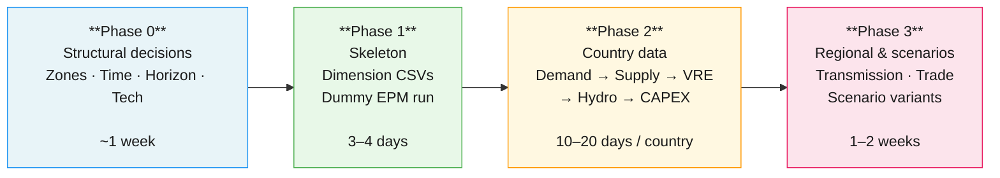
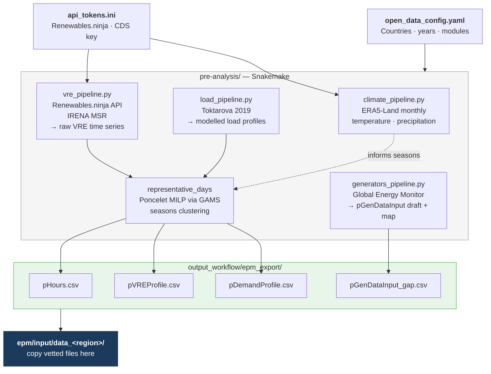
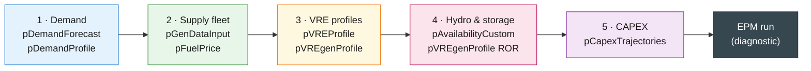
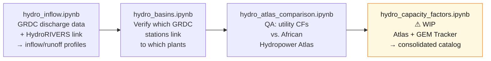

# Data Preparation

Building an EPM model is not a linear process of "fill 41 CSVs in sequence." It follows four phases — structural decisions, skeleton, country data, scenarios — each validated by EPM runs.

> **Golden rule:** structural decisions first. Data collection after. Scenarios last. Run EPM from day one to catch errors early.

---

## The four phases



!!! warning "The order matters more than the time spent"
    A structural decision made too late (wrong zone count, missing technology) forces you to redo most of the data collection. Spend the time upfront on Phase 0.

---

## Phase 0 — Structural decisions

These four decisions must be locked in **before any data collection**. They shape the dimensions of almost every CSV in the model. Budget a full week — they are the most consequential choices of the project.

### 1. Zones

How many zones, and which ones. Drives the `z` dimension of nearly every CSV.

**Method — floor + ceiling + convergence:**

- *Floor*: minimum below which you miss real physics. Triggers: official bidding zones, documented grid congestion, RE capacity factor spread > 25%, country size > 500 000 km², hydro far from load centres.
- *Ceiling*: computation budget × data availability. No sub-national load data = no sub-national zones.
- *Convergence*: test 3–4 levels on a simplified run. Stop when total system cost varies < 2% between two consecutive levels.

| Tool | When to use | Where |
|---|---|---|
| [gridflow (ESMAP)](https://github.com/ESMAP-World-Bank-Group/gridflow) | Given N zones, partitions a region using population/load/RE rasters | External tool |
| [PyPSA-Eur clustering](https://github.com/PyPSA/PyPSA-Eur) | Given N zones, partitions using OSM substations weighted by load — best for regions with good OSM/ENTSO-E coverage | External tool |

---

### 2. Representative time-slices

Number of representative days, hourly resolution, extreme days. Drives `pHours.csv` and every hourly profile.

| | Guideline |
|---|---|
| **Minimum** | 4 days (seasons) · 8+ if RE > 20% · 12+ if storage is significant |
| **Extreme days** | Always add 2–3 (winter peak, RE drought) |
| **Maximum** | Beyond 24–30 days, investment decisions rarely change |
| **Validation** | NRMSE on load duration curve < 3% · NRMSE on RE curves < 5% |

This is decided in Phase 0 but computed in Phase 1, once VRE and load time series are available. The tool is integrated in the repo — see the [Snakemake pipeline](#the-snakemake-pipeline) below.

---

### 3. Planning horizon

Base year + planning years. Drives `y.csv`.

- **Base year**: most recent year with complete data (typically 1–2 years before study start)
- **Planning years**: every 5 years is standard — e.g. 2030, 2035, 2040, 2045, 2050
- **End year**: 2050 for carbon neutrality studies; shorter for investment-focused work

---

### 4. Technology set

List of all generation, storage, and transmission technologies. Drives `tech.csv`, `fuel.csv`, `pTechFuel.csv`.

- **Same set across all countries.** Country-specific availability is handled via `max capacity = 0`, not a different tech list.
- **Include candidate technologies** (offshore wind, green hydrogen) even if not yet deployed — the model decides whether to invest.
- **Avoid editing the list after Phase 1** — it propagates through many CSVs.

!!! tip "Phase 0 deliverable"
    Write a short scoping note (3–5 pages) that fixes all four decisions above with brief justification. This is the reference document for the rest of the project — any later change to it forces revisiting earlier work.

---

## Phase 1 — Skeleton

Fill the CSVs that depend only on Phase 0 decisions, then run EPM end-to-end with dummy data. The goal is not useful results — it is to verify that your structure is sound before any real data collection.

### Regional dimension CSVs

| # | CSV | Content | How |
|---|---|---|---|
| 1 | `zcmap.csv` | Zone → country mapping | Manual (Phase 0 decision) |
| 2 | `y.csv` | Planning years | Manual (Phase 0 decision) |
| 3 | `tech.csv`, `fuel.csv` | Technology and fuel lists | Manual (Phase 0 decision) |
| 4 | `pTechFuel.csv` | Tech → fuel mapping | Manual (Phase 0 decision) |
| 5 | `pSettings.csv` | VOLL, discount rate, features | Copy from `data_test`, adjust |
| 6 | `pHours.csv` | Representative hours + weights | **Snakemake pipeline** ↓ |

### The Snakemake pipeline

`pHours.csv` and the associated hourly profiles (`pDemandProfile.csv`, `pVREProfile.csv`) are generated by the pipeline in `pre-analysis/`. Configure it once, run it, copy the outputs.



**Setup and run:**

```bash
# 1. Create the conda environment (once)
conda env create -f pre-analysis/open_data_env.yml -n epm-open-data
conda activate epm-open-data

# 2. Set up API keys (free accounts)
cp pre-analysis/config/api_tokens.example.ini pre-analysis/config/api_tokens.ini
# → Add Renewables.ninja token: renewables.ninja/profile
# → Add CDS API key: cds.climate.copernicus.eu  (for ERA5 climate data)

# 3. Edit config: set countries, years, number of representative days
#    pre-analysis/config/open_data_config.yaml

# 4. Run
cd pre-analysis
snakemake --snakefile Snakefile --cores 4
```

**Copy EPM-ready outputs:**

```bash
cp output_workflow/epm_export/pHours.csv          ../epm/input/data_<region>/config/
cp output_workflow/epm_export/pVREProfile.csv      ../epm/input/data_<region>/supply/
cp output_workflow/epm_export/pDemandProfile.csv   ../epm/input/data_<region>/load/
cp output_workflow/epm_export/pGenDataInput_gap.csv ../epm/input/data_<region>/supply/
```

### End-of-Phase-1 test

Fill all remaining CSVs with dummy zeros or single placeholder rows, then run:

```bash
conda activate esmap_env
python epm.py --folder_input data_<region> --diagnostic
```

The model should complete without errors. If it fails here, fix the **structural** issue before adding any real data — errors at this stage are not data quality problems, they are structural ones.

---

## Phase 2 — Country data

Most of the work happens here. For each country, fill CSVs in **dependency order**. The rule is strict: **demand first, then supply, then VRE, then hydro, then CAPEX.** Sizing generation before knowing the load leads to a fleet that doesn't match — you'll redo everything.

**Country ordering:** start with the country where you have the best data (or an existing EPM model). Continue with countries covered by ENTSO-E or equivalent open databases. Finish with countries where data is fragmented.

After each country: run `python epm.py --folder_input data_<region> --diagnostic` with that country populated and the rest as stubs. This catches unit mismatches and missing rows while they are cheap to fix.

---



---

### Wave 1 — Demand

| CSV | Content | Tool / Source |
|---|---|---|
| `pDemandForecast` | Annual peak + energy per zone/year | National utilities · [IEA WEO](https://www.iea.org/data-and-statistics/) · [IRENA Planning Dashboard](https://www.irena.org/Energy-Transition/Planning) — **manual** |
| `pDemandProfile` | Hourly shape (normalized to 1) | **Snakemake** `load_pipeline.py` → [Toktarova et al. 2019](https://doi.org/10.1016/j.ijepes.2019.105476) modelled profiles · [ENTSO-E](https://transparency.entsoe.eu/) for European countries |

!!! note
    `pDemandForecast` (annual MWh/MW by year) is always manual — no open database provides consistent country-level forecasts. `pDemandProfile` (hourly shape) is automated by the pipeline.

---

### Wave 2 — Supply fleet

| CSV | Content | Tool / Source |
|---|---|---|
| `pGenDataInput` | All existing + candidate plants | **Snakemake** `generators_pipeline.py` → [Global Energy Monitor (GEM)](https://globalenergymonitor.org/projects/global-integrated-power-tracker/) exports a draft `pGenDataInput_gap.csv` + interactive HTML map. **Always review before use** — GEM lags on recent retirements and sub-national plant locations. |
| `pFuelPrice` | Fuel cost per zone/year | [IEA WEO datasets](https://www.iea.org/data-and-statistics/) · [World Bank Commodity Forecasts](https://www.worldbank.org/en/research/commodity-markets) — **manual** |
| `pAvailabilityCustom` | Plant-level availability overrides | Start from `pAvailabilityDefault.csv` defaults; add rows only for plants that deviate |

---

### Wave 3 — VRE profiles

| CSV | Content | Tool / Source |
|---|---|---|
| `pVREProfile` | Hourly capacity factors per zone/tech (representative days) | **Snakemake** `vre_pipeline.py` → **Renewables.ninja API** + **IRENA MSR** → fed through `representative_days_pipeline.py` |
| `pVREgenProfile` | Absolute generation profiles (CSP, run-of-river) | See hydro wave below |

The pipeline chains these automatically: raw VRE time series → representative days optimizer → `pVREProfile.csv` in `output_workflow/epm_export/`. No intermediate steps required.

---

### Wave 4 — Hydro and storage

Hydropower availability requires matching plant locations to river discharge observations — this cannot be fully automated. The hydro notebooks in `pre-analysis/notebooks/` handle this and must be run **manually in order**:



**Data to download before running the notebooks** (place in `pre-analysis/dataset/`):

| Dataset | Source |
|---|---|
| GRDC monthly discharge stations | [grdc.bafg.de](https://grdc.bafg.de/) — manual request, place under `dataset/grdc_input/` |
| HydroRIVERS shapefiles | [hydrosheds.org](https://www.hydrosheds.org/products/hydrorivers) |
| African Hydropower Atlas v2 | `dataset/African_Hydropower_Atlas_v2-0.xlsx` |
| Global Hydropower Tracker | [globalenergymonitor.org](https://globalenergymonitor.org/projects/global-hydropower-tracker/) |

**Outputs:**

| CSV | Content |
|---|---|
| `pAvailabilityCustom` | Monthly reservoir availability factors per plant |
| `pVREgenProfile` (ROR) | Run-of-river hourly generation profiles |

---

### Wave 5 — CAPEX trajectories

| CSV | Content | Source |
|---|---|---|
| `pCapexTrajectories` | Cost evolution per technology and year | [IRENA Renewable Power Generation Costs](https://www.irena.org/Publications/2024/Sep/Renewable-Power-Generation-Costs-in-2023) · [IEA WEO technology assumptions](https://www.iea.org/reports/world-energy-outlook-2024) — **manual** |

CAPEX is typically regional rather than country-specific — one table can cover the entire study area.

---

## Phase 3 — Regional layer and scenarios

### Transmission and trade

Add the interconnection layer once all countries are filled:

| CSV | Content | Source |
|---|---|---|
| `pTransferLimit` | Cross-zone capacity per year (existing + candidate) | Regional TSOs, national plans, AfDB/regional studies |
| `pTradePrice` | Buy/sell prices on external borders | Energy ministries, IEA |
| `pExtTransferLimit` | Capacities to/from external zones | Same |
| `pLossesTransmission` | Line losses per link | Utility technical data, or ~2–3% as default |

### Scenarios

Scenarios overlay variant CSVs on top of the reference deployment. Keep the reference clean — do not embed scenario logic in the base data.

```csv
# scenarios.csv
paramNames,HighDemand,LowFuel,NoNewTransmission
pDemandForecast,demand/high_demand.csv,,
pFuelPrice,,supply/fuel_low.csv,
pTransferLimit,,,trade/no_expansion.csv
```

| Scenario type | CSVs to override |
|---|---|
| Demand growth | `pDemandForecast` |
| Fuel price | `pFuelPrice` |
| Carbon policy | `pCarbonPrice`, `pEmissionsLimit` |
| Technology costs | `pCapexTrajectories` |
| Transmission expansion | `pTransferLimit` |

See [Scenarios](../input/input_setup.md) for the full `scenarios.csv` syntax.

---

## Common pitfalls

| Pitfall | Why it hurts | How to avoid |
|---|---|---|
| Supply before demand | You size a fleet that doesn't match load — redo everything | Always fill `pDemandForecast` first |
| Skipping the Phase 1 dummy run | 15 CSVs filled, 40 tangled GAMS errors | Run `--diagnostic` with dummy zeros before any real data |
| Trusting GEM data as-is | GEM lags on retirements, sub-national locations, and recent commissions | Always cross-check `pGenDataInput_gap.csv` against utility data |
| Scenarios during collection | Reference deployment gets polluted | Freeze the reference first, add scenarios last |
| Re-zoning mid-project | Changing zonation mid-collection cascades through every CSV | Spend the time on Phase 0 convergence before touching data |
| Tools before patterns | Pipelines built too early miss real friction | Build automation only after doing the transformation manually twice |
