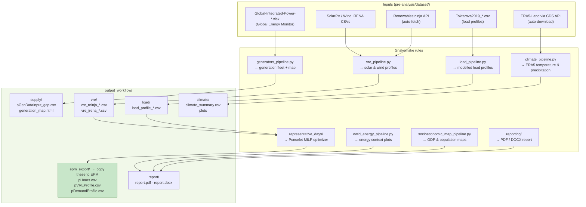

# Snakemake Pipeline Reference

The `pre-analysis/` Snakemake pipeline automates the data collection steps that have open, programmatic sources. This page is a technical reference for configuring and running it. For the full data preparation workflow including manual steps, see [Data Preparation](pre_overview.md).

---

## What the pipeline covers



---

## Repository layout

```
pre-analysis/
├── Snakefile                          ← single entry point
├── snakemake_helpers.py               ← shared utilities used by Snakefile
├── open_data_env.yml                  ← conda environment
├── config/
│   ├── open_data_config.yaml          ← edit this to configure the run
│   └── api_tokens.example.ini         ← copy to api_tokens.ini, add keys
├── pipelines/
│   ├── climate_pipeline.py
│   ├── vre_pipeline.py
│   ├── load_pipeline.py
│   ├── generators_pipeline.py
│   ├── hydro_reservoirs_pipeline.py
│   ├── entsoe_pipeline.py
│   ├── owid_energy_pipeline.py
│   └── socioeconomic_map_pipeline.py
├── representative_days/
│   ├── representativedays_pipeline.py
│   ├── representativeseasons_pipeline.py
│   └── gams/OptimizationModelZone.gms
├── reporting/
│   └── report.md.j2
├── dataset/                           ← raw inputs (git-ignored, put files here)
├── output_workflow/                   ← all outputs  (git-ignored)
└── notebooks/                         ← ad-hoc hydro notebooks (run manually)
    ├── hydro_inflow.ipynb
    ├── hydro_basins.ipynb
    ├── hydro_atlas_comparison.ipynb
    └── hydro_capacity_factors.ipynb
```

---

## Setup

### 1. Conda environment

```bash
conda env create -f pre-analysis/open_data_env.yml -n epm-open-data
conda activate epm-open-data
```

### 2. API keys

```bash
cp pre-analysis/config/api_tokens.example.ini pre-analysis/config/api_tokens.ini
```

Edit `api_tokens.ini` and fill in:

| Key | Where to get it |
|---|---|
| `renewables_ninja` | Free account at [renewables.ninja/profile](https://www.renewables.ninja/profile) |
| CDS API key | Free account at [cds.climate.copernicus.eu](https://cds.climate.copernicus.eu) — needed only if `climate_overview.download: true` |

### 3. Manual data downloads

Place these files in `pre-analysis/dataset/` before running:

| File | Source |
|---|---|
| `Global-Integrated-Power-<date>.xlsx` | [Global Energy Monitor](https://globalenergymonitor.org/projects/global-integrated-power-tracker/) |
| `SolarPV_BestMSRsToCover5%CountryArea.csv` | [IRENA MSR portal](https://www.irena.org/publications) |
| `Wind_BestMSRsToCover5%CountryArea.csv` | [IRENA MSR portal](https://www.irena.org/publications) |
| `Toktarova2019_...csv` | [Paper supplement](https://doi.org/10.1016/j.ijepes.2019.105476) |

The pipeline validates all required files before running and prints clear instructions if any are missing.

---

## Configuration — `open_data_config.yaml`

All pipeline behaviour is controlled by a single YAML file. Key sections:

```yaml
# Declare countries once, reuse everywhere
countries_common: &countries_common
  - Senegal
  - Guinea

# Generation fleet from Global Energy Monitor
gap:
  excel: Global-Integrated-Power-April-2025.xlsx
  countries: *countries_common
  tech_types: [solar, wind]

# ERA5 climate data
climate_overview:
  enabled: true
  countries: *countries_common
  start_year: 2015
  end_year: 2023

# VRE profiles via Renewables.ninja
rninja:
  start_year: 2015
  end_year: 2020

# VRE profiles via IRENA MSR
irena:
  countries: *countries_common

# Modelled load profiles (Toktarova 2019)
load_profile:
  countries: *countries_common
  year: 2020

# Season clustering (monthly → season labels)
representative_seasons:
  enabled: true
  K: 4           # number of seasons

# Representative days (Poncelet MILP)
representative_days:
  enabled: true
  n_representative_days: 12   # adjust based on Phase 0 decision
```

Enable or disable each module independently with its `enabled:` flag. Disabled modules are skipped entirely — useful when you already have data for a particular input.

---

## Running

```bash
conda activate epm-open-data
cd pre-analysis

# Full pipeline
snakemake --snakefile Snakefile --cores 4

# Dry run (shows what would run without executing)
snakemake --snakefile Snakefile --cores 4 --dry-run

# Specific target only
snakemake --snakefile Snakefile output_workflow/epm_export/pHours.csv --cores 2

# Force re-run of a specific rule
snakemake --snakefile Snakefile --cores 4 --forcerun representative_days
```

Outputs land in `output_workflow/`. The pipeline also generates a PDF and DOCX report (`output_workflow/report/`) summarising what was collected, with provenance and QA plots — useful as a data annex for the study.

---

## Pipeline outputs → EPM inputs

Once the pipeline completes, copy validated files to the study folder:

```bash
# Time representation
cp output_workflow/epm_export/pHours.csv           ../epm/input/data_<region>/config/

# Hourly profiles (representative days)
cp output_workflow/epm_export/pVREProfile.csv       ../epm/input/data_<region>/supply/
cp output_workflow/epm_export/pDemandProfile.csv    ../epm/input/data_<region>/load/

# Generation fleet draft — review before use
cp output_workflow/epm_export/pGenDataInput_gap.csv ../epm/input/data_<region>/supply/
```

!!! warning "Always review `pGenDataInput_gap.csv`"
    The GEM dataset is a good starting point but typically needs corrections: recent retirements, sub-national plant locations, commissioning dates, and fuel type assignments. Cross-check against utility data before using it in EPM.

After copying, validate the full input folder:

```bash
conda activate esmap_env
python epm.py --folder_input data_<region> --diagnostic
```
