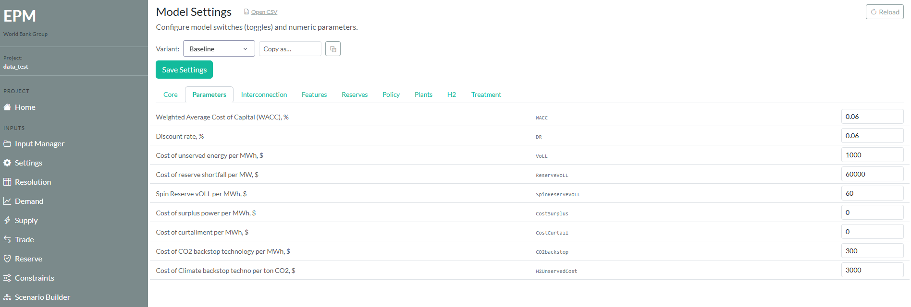
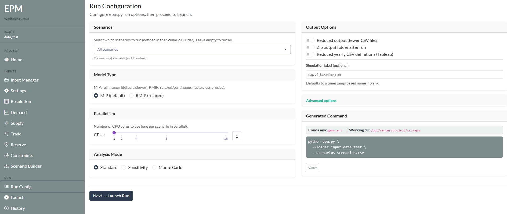
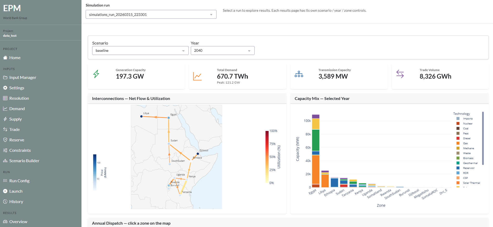

# Run from Dashboard

The EPM Dashboard provides a visual interface to configure, run, and explore EPM results, with no command line required.

**Best for:** first-time users, non-technical stakeholders, quick scenario testing.

---

## Launch the dashboard

From your EPM folder:

```sh
conda activate epm_env
python dashboard.py
```

Then open your browser at **http://localhost:8050**.

---

## Workflow

### 1. Select your input data

Upload or select your input folder from the left panel. The dashboard validates your data and highlights any missing or inconsistent inputs.



### 2. Configure your run

Set key parameters directly from the interface: model type (MIP / RMIP), number of scenarios, CPU cores.



### 3. Run EPM

Click **Run** to launch the model. A progress bar shows the solve status in real time.

### 4. Explore results

Once the run completes, navigate the built-in charts: capacity expansion by technology and year, generation dispatch, costs breakdown, emissions trajectory.



Results are also saved to `output/` as CSV files for use in Tableau or Python.

---

## Requirements

- EPM installed ([Installation](run_installation.md))
- Python environment active (`epm_env`)
- Dashboard dependencies installed (included in `requirements.txt`)
