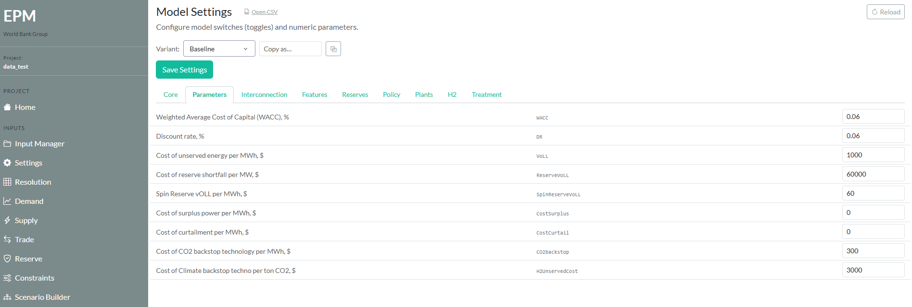
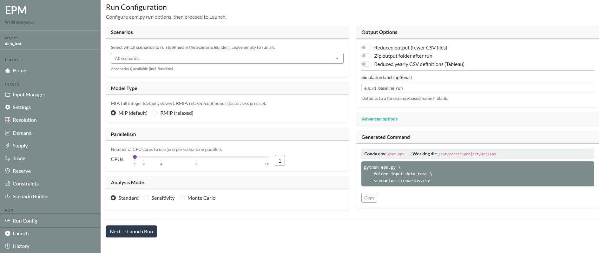
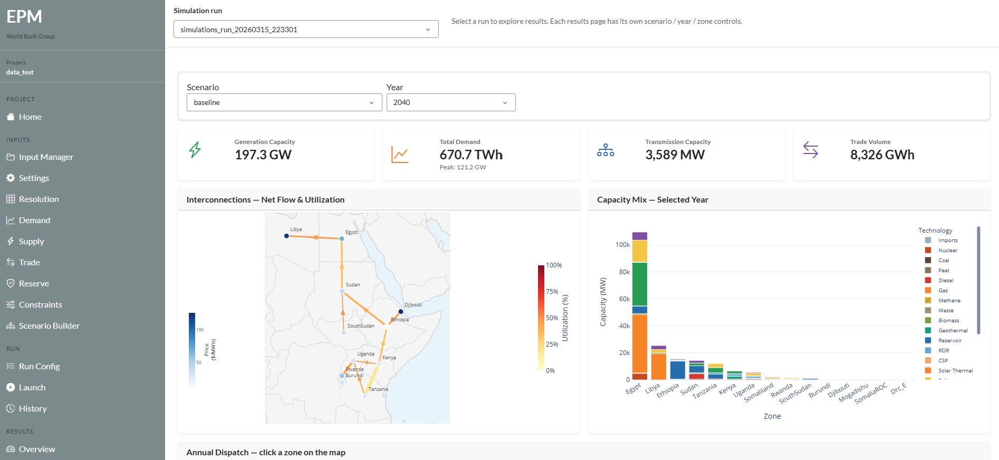

# EPM Dashboard

A visual interface to inspect your input data and explore results.

!!! warning "Beta — you cannot launch a run from the interface"
    The Dashboard is **beta software**, meant for reviewing inputs and reading results.

    The interface has a **Launch** tab, but **launching a run from it is not supported at
    this stage** — it is experimental and gives no usable error output. **Run the model from
    the command line** instead: see [Run from Python](run_python.md).

    Nothing is lost by doing so — a run started from the command line writes its CSV outputs
    to `output/`, which the Dashboard reads automatically. To diagnose a failed run, use the
    `.log` files: see [Debugging](run_debugging.md).

---

## Launch the dashboard

From your EPM folder:

```sh
conda activate epm_env
python dashboard/app.py
```

Then open your browser at **http://localhost:8080**.

!!! tip "Port already in use"
    Set the `PORT` environment variable to pick another one — for example
    `$env:PORT=8090` (Windows PowerShell) or `PORT=8090` (macOS / Linux) before the command
    above.

---

## Workflow

### 1. Select your input data

Upload or select your input folder from the left panel. The dashboard validates your data and highlights any missing or inconsistent inputs.



### 2. Configure your run

Set key parameters directly from the interface: model type (MIP / RMIP), number of scenarios, CPU cores. The **Run Config** tab assembles them into the matching `python epm.py` command, which you then **copy and run in a terminal** — see [Run from Python](run_python.md).



### 3. Explore results

Once the run completes, navigate the built-in charts: capacity expansion by technology and year, generation dispatch, costs breakdown, emissions trajectory.



Results are also saved to `output/` as CSV files for use in Tableau or Python.

---

## Requirements

- EPM installed ([Installation](run_installation.md))
- Python environment active (`epm_env`)
- Dashboard dependencies installed (included in `requirements.txt`)
