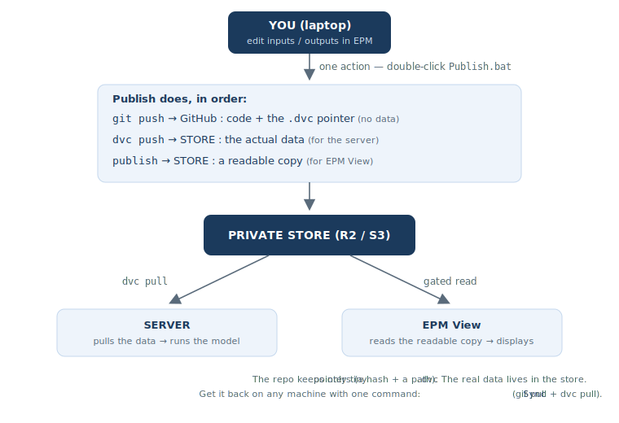

# Publishing & Syncing Data (DVC)

<style>.md-typeset { font-size: 0.8rem; }</style>

EPM **code** is public, but the **data** (input CSVs, results) is kept in a **private
store** — not in this public repository. The repo only keeps tiny **pointer files**
(`*.dvc`); the real data lives in the store and is fetched on demand.

This page is a step-by-step guide: install once, then **publish** your data and **get it
back** on any machine (your laptop, the server). No prior knowledge of DVC is assumed.

!!! note "Prototype"
    The store is currently a Cloudflare R2 bucket (test data). For confidential data, the
    production store will be the World Bank S3 — same workflow, different endpoint.

---

## The idea in one picture



**What is DVC?** Think *"git for data"*. A large CSV is replaced in git by a 6-line pointer
(`pVREProfile.csv.dvc` = a hash + a path, **no values**). The real file lives in the store
and is moved with `dvc push` / `dvc pull`. So git stays light, and the data stays private.

---

## 1. Set up your machine (once)

You work in **your clone of the EPM repo** — the same folder you run EPM from.

??? tip "New to the command line? — how to open a terminal (read me first)"
    A few steps below are **commands** you type in a **terminal** opened **inside your EPM
    folder**. To open one:

    - **Easiest — in VS Code:** open your EPM folder in VS Code, then menu **Terminal → New
      Terminal**. A panel opens at the bottom, already pointing at your EPM folder.
    - **Or — in Windows:** open your EPM folder in File Explorer, click the **address bar** at
      the top, type `powershell`, and press **Enter**. A blue window opens in that folder.

    Then **paste a command and press Enter**. On Windows this terminal is **PowerShell**.
    (Day-to-day, publishing and syncing are just **double-clicks** — `Publish.bat` / `Sync.bat`
    — no terminal needed.)

=== "Already running EPM here"

    Your Python environment is ready — just add the data tools:
    ```bash
    pip install -r requirements.txt
    ```
    Installs **DVC**, `s3fs`, and (on Windows) `pip-system-certs`.

=== "Fresh machine"

    Set EPM up first, then install:
    ```bash
    git clone https://github.com/ESMAP-World-Bank-Group/EPM.git
    cd EPM
    git checkout <your-branch>             # e.g. blacksea_2026
    conda activate <your-epm-env>          # your EPM Python environment
    pip install -r requirements.txt
    ```

**Then (both cases) add your store keys — once:**

1. Copy the template: `tools/.env.example` → `tools/.env`
2. Open `tools/.env` and paste the 4 values (ask the store admin):
   ```
   AWS_ACCESS_KEY_ID=...
   AWS_SECRET_ACCESS_KEY=...
   STORE_ENDPOINT=https://....r2.cloudflarestorage.com
   STORE_BUCKET=...
   ```

!!! warning "Never commit your keys"
    `tools/.env` is **git-ignored** on purpose (this repo is public). Only the empty
    `tools/.env.example` is committed.

That's it — the store URL/endpoint is already in the repo (`.dvc/config`).

---

## 2. Is your model already on the store?

- Look in `epm/input/`. If you see a **pointer file** like `data_<model>.dvc` (and the data
  folder is git-ignored) → your model is **already migrated**. **Skip to step 4 (Publish).**
- If the data folder is still committed in git (no `.dvc` pointer) → your model is **not yet
  migrated**. Do **step 3** first (once per model).

---

## 3. Onboard a new model (once per model)

This moves a model's data **out of git** into the store. Do it **once**, by whoever sets the
model up; afterwards everyone just uses *setup + publish/sync*.

It's **one command**:

1. **Open a terminal in your EPM folder** (see the *"how to open a terminal"* tip in step 1).
2. If you use conda, activate your EPM environment: `conda activate <your-epm-env>`.
3. Run the command below, replacing `data_sapp` with **your** data folder name:

    ```powershell
    .\tools\setup_model.ps1 data_sapp
    ```

4. It prints a short summary, then asks **`Continue? (y/N)`** — type **`y`** to proceed, or
   **`N`** to cancel. Nothing changes until you type `y` (safe to just look).

Then **review** (`git status`) and **publish** (double-click `Publish.bat`). Finally, to make
**EPM View** show this model, add its branch name to `R2_BRANCHES` in `src/utils/epmFetch.js`
of the `epm-data-explorer` repo.

??? info "What `setup_model.ps1` does under the hood (the manual steps)"
    The script automates exactly these — your files **stay on disk**, and it commits/pushes
    nothing (you review, then publish):

    ```bash
    # 1. Initialise DVC for the repo (once per repo)
    dvc init
    # 2. Point DVC at the store (once — already set in this repo's .dvc/config)
    dvc remote add -d store s3://<bucket>/dvcstore
    dvc remote modify store endpointurl <endpoint>
    # 3. .gitignore: drop the whitelist of the data folder, keep its pointer tracked
    #        !epm/input/data_<model>.dvc
    # 4. Stop tracking the data in git (files stay), then hand the folder to DVC
    git rm -r --cached epm/input/data_<model>
    dvc add epm/input/data_<model>            # creates the .dvc pointer
    ```

---

## 4. Publish your data

Whenever you change inputs (or want to show new results), **publish in one action**:

=== "Windows"
    Double-click **`Publish.bat`** at the repo root.
=== "Command line"
    ```bash
    powershell -File tools/publish.ps1
    ```

Publishing does **four things, in order** — note it uses **both git and DVC**:

| Step | Command | What it sends, and where |
|------|---------|--------------------------|
| 1 | `dvc add` | re-hashes your changed data → updates the small `.dvc` **pointer** (local only) |
| 2 | **`git` commit + push** | sends the **pointer** (a tiny text file) to **GitHub** — *yes, a real git commit on your branch* |
| 3 | `dvc push` | uploads the **actual data** to the **store** (so the server can pull it) |
| 4 | upload | copies a **readable** version (inputs + `epm/output_view/`) to the store (for **EPM View**) |

So your code and pointer go to **GitHub** (git); the data goes to the **store** (DVC + the
readable copy). The data itself **never** goes to GitHub.

!!! tip "Showing results in EPM View"
    Copy the runs you want to display into
    `epm/output_view/<run>/<scenario>/output_csv/` **before** publishing (only `.csv` files
    are sent). `epm/output_view/` is a local staging folder (git-ignored).

---

## 5. Get the data back (any machine / the server)

=== "Server (Linux)"
    ```bash
    bash tools/sync.sh
    ```
=== "Windows"
    Double-click **`Sync.bat`**.

This runs `git pull` (code + pointers) then `dvc pull` (data from the store) — then you can
run the model with up-to-date data.

---

## Troubleshooting

- **`Unable to locate credentials`** → keys not loaded. On the server, either
  `export AWS_ACCESS_KEY_ID=… AWS_SECRET_ACCESS_KEY=…`, or set them once with
  `dvc remote modify --local store access_key_id …` (stays in git-ignored `config.local`).
- **`CERTIFICATE_VERIFY_FAILED` / SSL** (corporate laptop) → a TLS proxy is intercepting.
  `pip-system-certs` (installed by `requirements.txt` on Windows) fixes it by trusting the OS
  certificate store. If it persists, try off-VPN. The AWS server is not affected.
- **`dvc` command not found** (server) → use `python -m dvc …`, or add `~/.local/bin` to
  your `PATH`.

---

## Files (in `tools/`)

| File | Role |
|------|------|
| `publish.ps1` | engine behind `Publish.bat` |
| `sync.ps1` / `sync.sh` | get code + data (Windows / server) |
| `setup_model.ps1` | onboard a new model's data to the store (one-time, step 3) |
| `upload_to_r2.py`, `upload_output_view_to_r2.py` | upload the readable copies |
| `.env.example` | keys template (copy to `.env`, git-ignored) |
