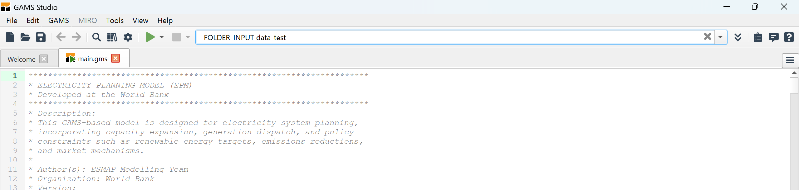

# Run from GAMS Studio

Direct access to the model files, solver logs, and intermediate outputs. Suited for inspecting equations, tracing errors, and testing model changes.

---

## Steps

1. Open **GAMS Studio**.

2. Open `main.gms`: go to **File > Open in New Group**, navigate to your EPM folder, and select `main.gms`.

3. Make sure `main.gms` is set as the **main file** (green triangle on its tab). If not, right-click it and choose **Set as Main File**.



4. In the **Task Bar** at the top, specify your arguments. All arguments must be prefixed with `--`. `FOLDER_INPUT` is the only required argument:

    ```
    --FOLDER_INPUT data_test
    ```

    All other arguments are optional and fall back to the defaults listed below.

5. Click **Compile/Run**.

6. Check the **Process Log** for errors. If successful, `epmresults.gdx` will appear in the project directory.

---

## Default arguments

If not specified on the command line, these files fall back to their defaults:

| Argument | Default | Description |
|---|---|---|
| `BASE_FILE` | `base.gms` | Core model file (included only on fresh runs) |
| `REPORT_FILE` | `generate_report.gms` | Report generation script |
| `READER_FILE` | `input_readers.gms` | Input reading script |
| `VERIFICATION_FILE` | `input_verification.gms` | Input verification script |
| `TREATMENT_FILE` | `input_treatment.gms` | Input preprocessing script |
| `DEMAND_FILE` | `generate_demand.gms` | Demand generation script |
| `TRACE` | `0` | Set to `1` for detailed input reading logs |
