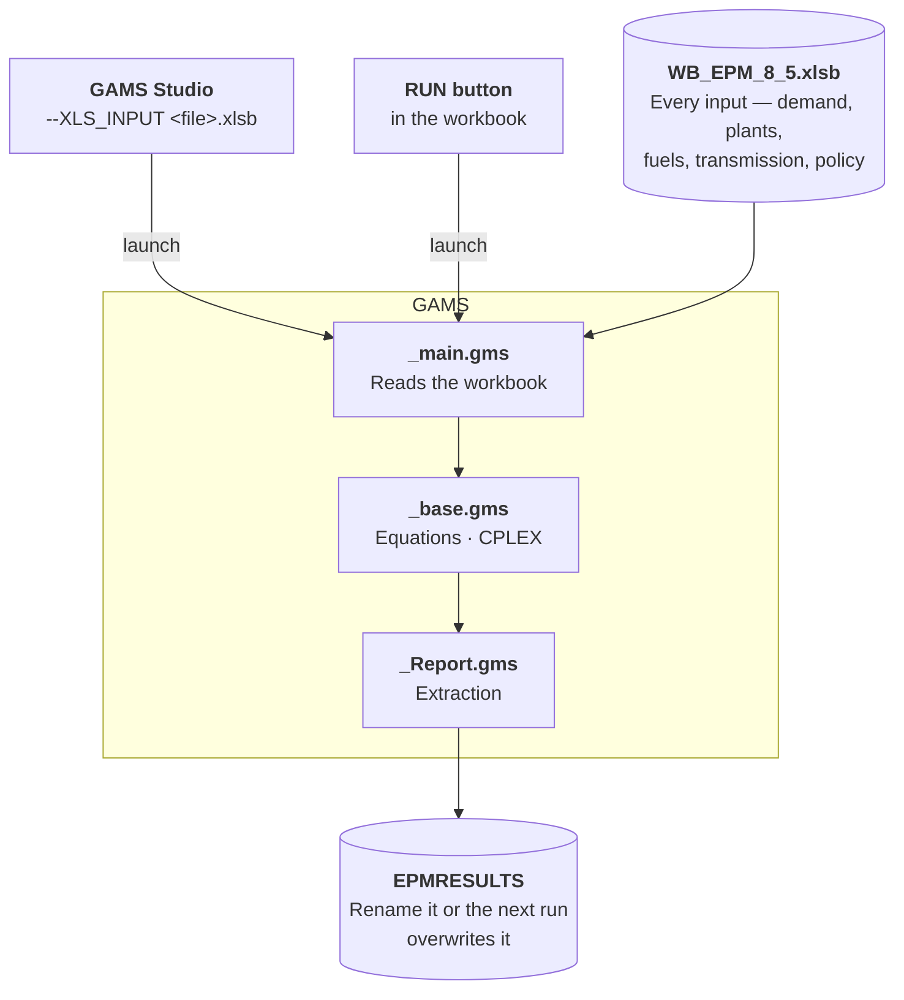

# Legacy version — EPM v8.5 (Excel)

Before version 9, EPM ran from an **Excel workbook** driving a set of GAMS files. That
generation is archived here for teams that still maintain a v8.5 model.

!!! danger "Archived — not maintained"
    v8.5 receives no fixes, no support and no new features. Use it only to read or re-run an
    existing study. For anything new, use the current version — see
    [Installation](run_installation.md).

---

## Which version should I use?

<div class="grid cards" markdown>

-   **EPM 9 — CSV + Python** *(current)*

    ---

    Inputs as CSV files, orchestrated by Python, solved in GAMS. **Full feature set**:
    scenarios, parallel runs, sensitivity and Monte-Carlo analysis, H2 module, automated
    postprocessing, version control.

    Some familiarity with **Python and GAMS helps** and unlocks customization, but is not
    required for a standard run.

    [→ Get started](run_installation.md)

-   **EPM v8.5 — Excel** *(legacy)*

    ---

    All inputs in one `.xlsb` workbook, launched from GAMS Studio, results written back into
    Excel. **No Python involved** — the whole model is driven from the spreadsheet.

    Frozen feature set, and no way to track changes in git.

    [→ Contents of the pack](#what-is-in-the-pack)

</div>

---

## How v8.5 works

One Excel workbook holds every input. Three GAMS files do the work:

| File | Role |
|---|---|
| `WB_EPM_v8_5_main.gms` | Entry point — reads the workbook, drives the solve |
| `WB_EPM_v8_5_base.gms` | Core equations (equivalent of today's `base.gms`) |
| `WB_EPM_v8_5_Report.gms` | Result extraction back to Excel |

<div class="compact-diagram" markdown="1">

</div>

There is no command line and no scenario system: **one workbook is one run**. Variants are
separate copies of the file — which is why the pack ships `Ghana_2050_hydro_BaU` as its own
workbook rather than as a scenario.

---

## Running it

Two routes. Both need the three `.gms` files and the workbook in the **same folder**.

=== "From GAMS Studio"

    1. Open the three `.gms` files together — *File → Open in new group*.
    2. Set **`WB_EPM_v8_5_main.gms`** as the main file (green triangle on its name).
    3. In the argument bar, pass the workbook:
       ```
       --XLS_INPUT WB_EPM_8_5.xlsb
       ```
    4. Run. The Process Log reports progress and tells you when the solve ends.

=== "From the workbook"

    Step 1 is done **once**. After that you never leave Excel.

    1. In GAMS Studio, set **`WB_EPM_v8_5_base.gms`** as the main file, put `s=base` in the
       argument bar and compile. This writes **`base.g00`** — the precompiled model — next to
       the sources.
    2. Open the workbook, go to the **Home** tab, and check that every status reads `OK` and
       that the GAMS path is right.
    3. **Set Output** → where results are written. **Set Model** → pick
       `WB_EPM_v8_5_main.gms`.
    4. **RUN**. A console window tracks the solve and closes on its own; the result file opens
       automatically, named after *Scenario name* on the Home tab.

!!! warning "Results are overwritten"
    From GAMS Studio the output is always written to **`EPMRESULTS`** in the model folder, and
    the next run overwrites it. **Rename it after every run** you want to keep.

---

## What is in the pack

| Folder | Contents |
|---|---|
| `Generic model/` | `WB_EPM_8_5.xlsb` — the blank template — plus the three `.gms` files |
| `Ghana example/` | `WB_EPM_8_5_Ghana_Example.xlsb`, the `.gms` files, `cplex.opt`, `README.txt`, the Ghana decarbonization deck (2022), and `Initial_model/` with a `Ghana_2050_hydro_BaU` variant |
| `Documentation/` | `WB_Electricity_Planning_Model_Documentation_2023.pdf`, `Running EPM/` (how to run EPM, how to build `base.g00`, the Engine looping tool manual) and two training decks |

The v8.5 documentation is **inside the pack** — the 2023 PDF is the reference manual for that
version. Nothing on this site describes v8.5 beyond this page.

---

## Requirements

- **Windows** — the workbook relies on Excel macros
- **Excel** able to open `.xlsb` files, with macros enabled
- **GAMS** with a valid **CPLEX** license, and GAMS Studio to launch runs

!!! warning "Compatibility not guaranteed"
    v8.5 was last touched in 2024 and has **not been tested against recent GAMS releases**.
    It may need adjustment on a current GAMS installation. No support is provided if it
    does not run.

---

## Archived documentation

Two distinct things carry the "v8.5" name — don't confuse them:

| | What it is | Where |
|---|---|---|
| **v8.5 Excel** | The workbook-driven model described on this page. Never on GitHub. | Starter pack (see below) |
| **`v8.5` git tag** | The *transition* era: GAMS files still named `WB_EPM_v8_5_*.gms`, but already wrapped in Python with CSV inputs. Not an ancestor of `main`. | [tree/v8.5/docs](https://github.com/ESMAP-World-Bank-Group/EPM/tree/v8.5/docs) |

The tag preserves documentation pages that were dropped from this site, notably
`old/step_by_step.md` (adapting the `WB_EPM_v8_5_*.gms` files by hand) and
`engine_looping_tool.md` (the Engine looping tool, now superseded by
[Advanced Python Options](run_python_advanced.md)).

---

## Get the pack

<!-- PUBLICATION CHECKLIST — do all three before replacing the URL below:
     1. Remove `gamslice.txt` from the archive (GAMS license file, must not be redistributed).
     2. Confirm `WB_Electricity_Planning_Model_Documentation_2023.pdf` and the two training
        decks are cleared for public release.
     3. Publish as GitHub release `v8.5-excel-legacy`, then swap PACK_URL in the link below. -->

**[Download EPM v8.5 Starter pack (.zip, ~20 MB)](#)**{ .md-button }
<!-- ^ replace `#` with the release asset URL -->

!!! info "Not published yet"
    The archive is being prepared for release. Until it is up, contact the EPM team for a copy.

The zip carries the full reference material this page summarizes: the 2023 model
documentation PDF, the step-by-step *Running EPM* notes, and the training decks. The GAMS
license file shipped in the original folder is **removed** from the published archive — bring
your own GAMS licence.

Earlier releases are archived on [Zenodo](https://zenodo.org/communities/esmap-epm).

---

## Moving to version 9

The current version expects CSV inputs. See
[From Excel to CSV](../input/input_from_excel_to_csv.md) for how to port an existing
workbook.
