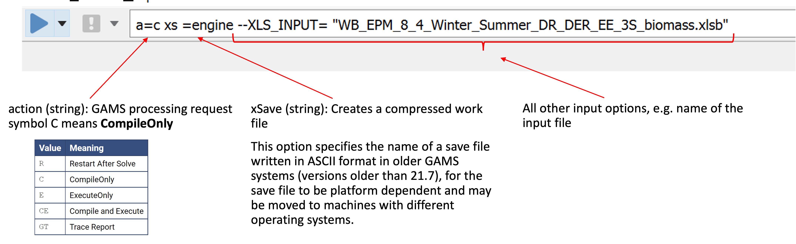
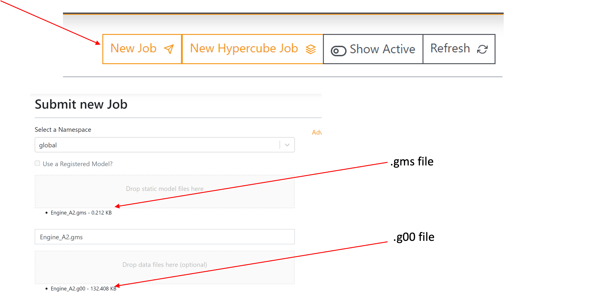
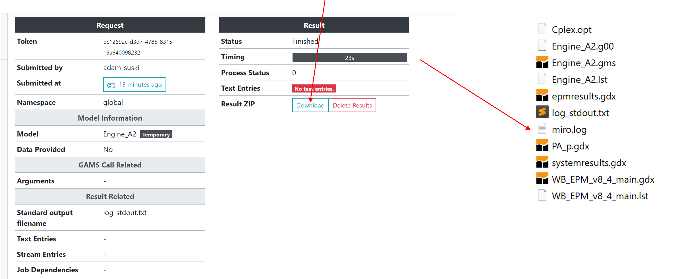

# Running EPM with GAMS ENGINE Remote Server

### Step 1: Ensure the Model Compiles locally
1. Run the model locally to verify correct compilation.
2. Fix any compilation errors.

### Step 2: Prepare Save File (`.g00` type) **locally**
#### Use GAMS with the following command options:
  - `action`: Set to `CompileOnly` (`C`).
  - `xSave`: Creates a `.g00` save file.



#### Run the model **locally** and confirm the `.g00` file was created

### Step 3: Create `Engine_Base.gms` File
The submission of the `.g00` file need to be supported with the .gms file containing the running commands and the CPLEX options: 

- The `.gms` file must contain:
  - GAMS commands.
  - CPLEX options (e.g., file names, log output settings).

```
$onecho > cplex.opt 
startalg 4  
scaind  1  
lpmethod 4  
threads 4 
predual -1  
$offEcho 
$if 'x%gams.restart%'=='x' $call gams Engine_Base.gms r=Engine_Base lo=3 o=WB_EPM_v8_5_main_V3.lst
```

where:
- CPLEX options are defined in `$onecho` and `$offEcho` blocks.
- `Engine_Base.gms` is the current GAMS file.
- `r=Engine_Base` specifies the restart file you created.
- `lo=3` sets the log output level.
- `o=WB_EPM_v8_5_main_V3.lst` specifies the log file name.


### Step 4: Upload Files to the Engine
- Go to the Engine's web interface: https://engine.gams.com/.
- Upload the `.gms` and `.g00` files to the Engine.



### Step 5: Download and Extract Output Files
When the model is solved, download the compressed output file and extract it into the folder.


### Step 6: Process the Output Files (optional)
- Post-process GDX data into Excel externally (Engine runs on Linux).

Since the engine runs on the Linux system, it is not able to perform some of the commands exporting data from gdx to excel. Therefore, this part of the report file needs to be processed outside of the Engine run.

### Troubleshooting Tips
1. **Script Runs Too Quickly**: When the program solved faster then you expected, it may mean that you have an Error within the script or the model is infeasible. 
2. **Memory Issues**: If you are running very big model, CPLEX can show ‘out of memory’ issue. This will end the execution immediately on Engine, but will not show any information. Engine log file will not show you any issues and errors related to CPLEX. 

